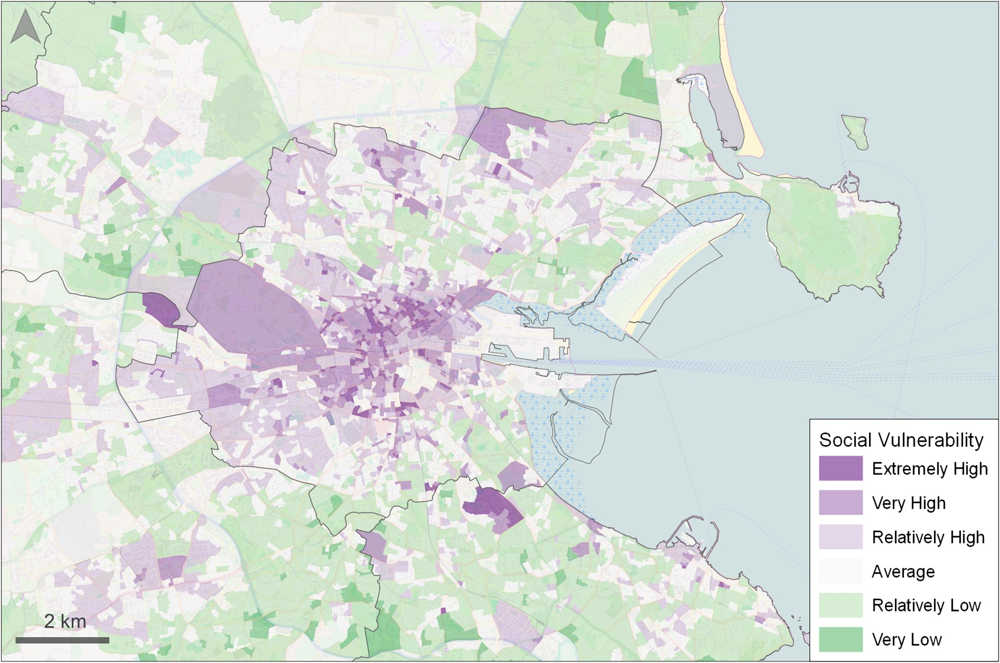

# The Irish Social Vulnerabiltiy to Environmental Hazards Index (ISVEHI)
The ISVEHI is a spatial assessment of the social vulnerability of Ireland’s population to climate-related hazards (e.g. flooding, (coastal, fluvial, and pluvial), coastal erosion, strong wind/storms, heatwaves). Social vulnerability is “the sensitivity of a population to natural hazards and its ability to respond to and recover from the impacts of hazards”.
The index has been developed using a total of 22 indicators representing attributes, such as age, health, education level, local knowledge. These indicators were combined with equal weighting and mapped at the CSO small area scale with each small area being assigned a social vulnerability score. An example of the spatial output for Dublin can be seen below.

This repository supports the journal publication …

# Why has the ISVEHI been created?
Ireland’s climate is changing. Observations show evidence of higher temperatures, rising sea levels, and changing patterns of precipitation, with trends expected to continue and intensify into the future. Consequently, an increase in the occurrence and intensity of fluvial and coastal flooding, coastal erosion, drought, and heatwaves are expected. 
These hazards can impact upon people and assets, and depending on the severity, may cause a loss of life or damage to key infrastructure. Risk assessments are therefore needed to understand the risks posed by these hazards to inform adaptation. 

The Intergovernmental Panel on Climate Change (IPCC), define risk as comprising three components: a hazard, exposure to the hazard, and vulnerability. In Ireland, data and information on future climate change, hazards, and assets that are potentially exposed are available already. However, to date, there has been no national assessment of vulnerability to environmental hazards within Ireland.   

To begin to address the social vulnerability knowledge gap in Ireland, the Irish Social Vulnerability to Environmental Hazards Index (ISVEHI) has been developed.

# The Code
The ISVEHI was created using ‘R’ and data from the CSO Census and Copernicus. 

 
 
